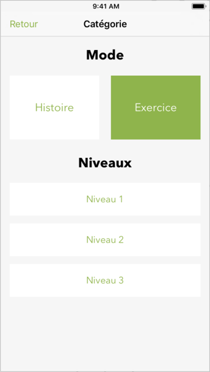

# pMot
University project developed in 4 days for the IOS course.
## Description
PMot  (petit mot ) it’s an application to teach languages by presenting basic vocabulary, the app has a set of words in English ,French and Spanish and proposes challenges to pair the words with his translation in the chosen language 

With this project, we learned 
- The basics of working on an IOS mobile application, 
- How to handle multiple languages.
- The usage of a local CSV database.
- The creation interactive screens.

## Visuals

